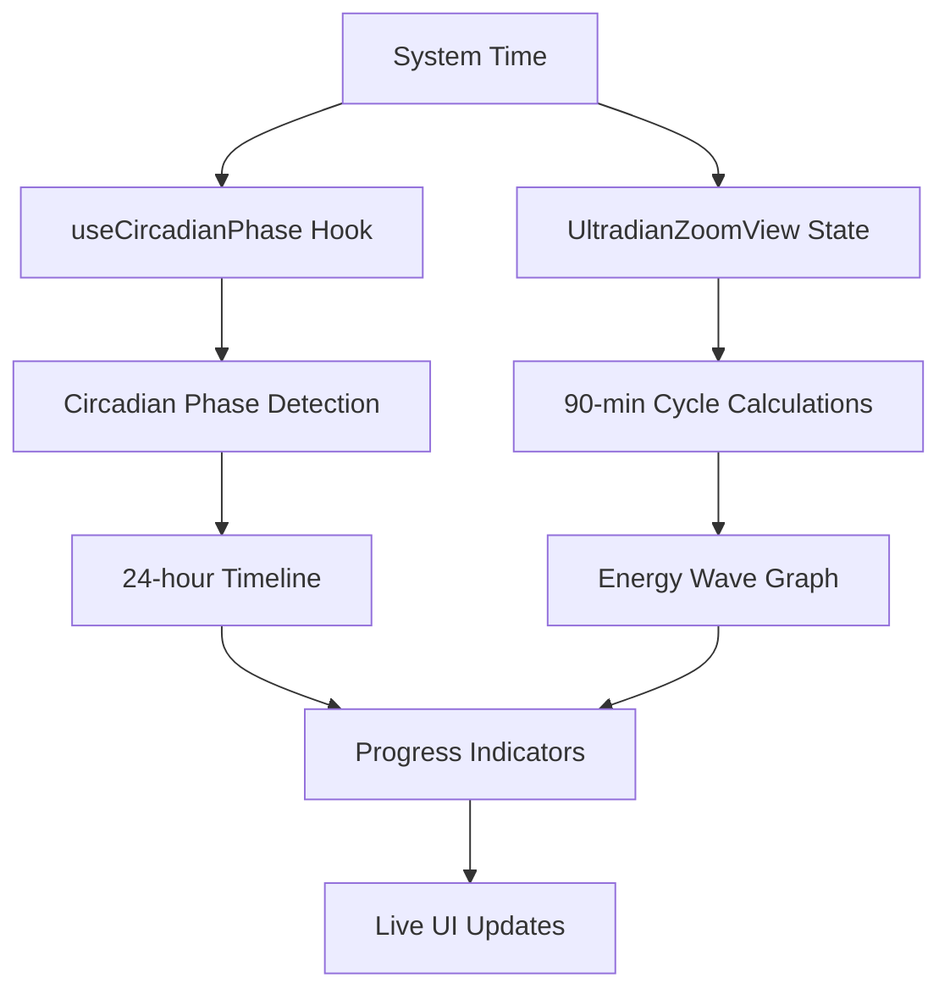

# Circadian Rhythm App — Architecture

## 1. High-Level Overview

The application is a sophisticated native desktop app for macOS built with Tauri and React. It provides comprehensive circadian and ultradian rhythm tracking with real-time visualization and precise timing features.

**Major Update**: The app now integrates real HealthKit data to provide personalized circadian rhythm analysis based on actual physiological patterns rather than generic assumptions.

*   **Frontend**: React with TypeScript, built using Vite. Features a component-based architecture with specialized rhythm tracking components.
*   **Styling**: [shadcn/ui](https://ui.shadcn.com/) and [Tailwind CSS](https://tailwindcss.com/) for a modern, utility-first approach with dynamic color theming.
*   **Backend & Packaging**: [Tauri](https://tauri.app/) wraps the web frontend into a lightweight, secure, and native macOS application. All application logic is currently client-side.
*   **Real-time Features**: Advanced timing systems with second-level precision for both circadian (24-hour) and ultradian (90-minute) rhythm tracking.

## 2. File & Folder Structure

The project features a modular component-based architecture optimized for rhythm tracking.

```
circada/
│
├── src/
│   ├── components/
│   │   ├── UltradianDashboard.tsx   # Primary: Minimal dashboard for current cycle
│   │   ├── PredictiveAnalytics.tsx  # Data-rich predictive interface
│   │   ├── HealthDataImporter.tsx   # Health data import and analysis UI
│   │   ├── MenubarView.tsx          # Compact menubar interface
│   │   └── ui/                      # shadcn/ui components (Card, Progress, Button, etc.)
│   ├── services/
│   │   ├── healthDataParser.ts      # HealthKit XML parser for real data
│   │   ├── realDataCircadian.ts     # Personal circadian analysis engine
│   │   └── circadian.ts             # Legacy rhythm calculation algorithms
│   ├── hooks/
│   │   └── useCircadianPhase.ts     # Real-time circadian phase state management
│   ├── utils/
│   │   └── time.ts                  # Time formatting and precision calculations
│   ├── App.tsx                      # Main application component with health data integration
│   └── main.tsx                     # React root renderer
│
├── public/
│   ├── export.xml                   # Sample HealthKit data for testing
│   └── export_cda.xml               # Clinical document format data
│
├── src-tauri/
│   ├── icons/                       # Application icons
│   ├── Cargo.toml                   # Rust dependencies
│   ├── tauri.conf.json              # Tauri configuration (windows, menubar, tray)
│   └── src/
│       └── main.rs                  # Tauri Rust entry point
│
├── package.json                     # Node.js dependencies
└── architecture.md                  # This file
```

## 3. State & Data Flow

The application features a sophisticated real-time state management system with multiple timing layers.



1.  **Real-time Clock**: Multiple `useEffect` hooks poll system time every second for precise timing
2.  **Dual Rhythm Tracking**: 
    - Circadian phases (24-hour daily cycles)
    - Ultradian cycles (90-minute energy cycles)
3.  **Dynamic Calculations**: Real-time computation of:
    - Current phase positions and progress
    - Energy intensity percentages
    - Countdown timers with second precision
4.  **Live UI Updates**: All components update simultaneously for synchronized visualization

## 4. Current Feature Set

### Real Health Data Integration
- **HealthKit XML Parser**: Processes Apple Health exports with 225K+ records
- **Personal Circadian Analysis**: Calculates individual wake/sleep patterns from actual data
- **Heart Rate Integration**: Live monitoring with prediction confidence scoring
- **Sleep Efficiency Analysis**: Real sleep quality metrics and personalized recommendations
- **Energy Peak Detection**: Identifies personal energy patterns from physiological data

### Minimal Dashboard Interface
- **UltradianDashboard**: Clean, focused view of current 90-minute cycle status
- **Live Countdown Timer**: MM:SS format with real-time seconds updates
- **Energy Phase Indicators**: Color-coded High/Low/Transition states with intensity percentages
- **24-Hour Time Axis**: Wave visualization with actual clock times (HH:MM format)
- **Confidence Scoring**: Live data reliability indicators based on heart rate variance

### Predictive Analytics Interface
- **6-Hour Forecasting**: Upcoming energy peaks, troughs, and optimal focus windows
- **Heart Rate Variance Analysis**: Real-time comparison with expected patterns
- **Personal Insights**: Data-driven recommendations based on individual sleep/energy patterns
- **2-Hour Energy Graph**: Visual timeline of predicted energy levels with confidence bands

### Enhanced User Experience
- **Health Data Import**: Easy-to-use interface for loading HealthKit exports
- **Real vs Simulated Data**: Toggle between personal data analysis and demo mode
- **Live Data Adjustments**: Real-time prediction updates based on current heart rate
- **Responsive Design**: Clean, minimal top dashboard with data-rich sections below

## 5. Next Steps & Future Enhancements

With the comprehensive ultradian tracking system in place, focus can shift to advanced features and integrations.

### Completed ✅
*   **Refactored Logic**: Extracted rhythm calculations into dedicated service files with proper separation of concerns
*   **Enhanced UI**: Implemented sophisticated real-time visualization with dual rhythm tracking
*   **Component Architecture**: Built modular, reusable components for rhythm visualization
*   **Precise Timing**: Added second-level precision timing throughout the application

### Planned Enhancements 🚧
*   **Menubar Mode**: Implement a compact menubar-only display for quick rhythm checking
*   **User Preferences**: Allow customization of wake-up/sleep times and energy phase preferences
*   **Data Persistence**: Store rhythm data and preferences locally for historical tracking
*   **Advanced Analytics**: Add weekly/monthly rhythm pattern analysis and insights

### Future Integrations 🔮
*   **Apple HealthKit**: Integrate with native health data for automatic sleep/activity tracking
*   **Calendar Integration**: Show optimal timing for meetings and focused work based on energy phases
*   **Notification System**: Smart alerts for phase transitions and optimal activity timing
*   **Export Features**: Generate rhythm reports and data export for external analysis