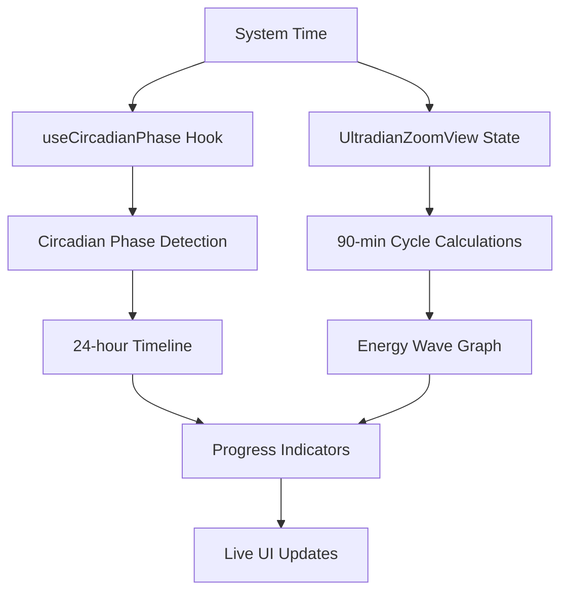

# Circadian Rhythm App — Architecture

## 1. High-Level Overview

The application is a sophisticated native desktop app for macOS built with Tauri and React. It provides comprehensive circadian and ultradian rhythm tracking with real-time visualization and precise timing features.

*   **Frontend**: React with TypeScript, built using Vite. Features a component-based architecture with specialized rhythm tracking components.
*   **Styling**: [shadcn/ui](https://ui.shadcn.com/) and [Tailwind CSS](https://tailwindcss.com/) for a modern, utility-first approach with dynamic color theming.
*   **Backend & Packaging**: [Tauri](https://tauri.app/) wraps the web frontend into a lightweight, secure, and native macOS application. All application logic is currently client-side.
*   **Real-time Features**: Advanced timing systems with second-level precision for both circadian (24-hour) and ultradian (90-minute) rhythm tracking.

## 2. File & Folder Structure

The project features a modular component-based architecture optimized for rhythm tracking.

```
circada/
│
├── src/
│   ├── components/
│   │   ├── UltradianZoomView.tsx    # Primary: Detailed 90-min cycle view
│   │   ├── UltradianZoomedGraph.tsx # SVG-based energy wave visualization
│   │   ├── WaveVisualization.tsx    # 24-hour ultradian rhythm display
│   │   ├── MenubarView.tsx          # Compact menubar interface
│   │   └── ui/                      # shadcn/ui components (Card, Progress, etc.)
│   ├── hooks/
│   │   └── useCircadianPhase.ts     # Real-time circadian phase state management
│   ├── services/
│   │   └── circadian.ts             # Core rhythm calculation algorithms
│   ├── utils/
│   │   └── time.ts                  # Time formatting and precision calculations
│   ├── App.tsx                      # Main application component with layout
│   └── main.tsx                     # React root renderer
│
├── src-tauri/
│   ├── icons/                       # Application icons
│   ├── Cargo.toml                   # Rust dependencies
│   ├── tauri.conf.json              # Tauri configuration (windows, menubar, tray)
│   └── src/
│       └── main.rs                  # Tauri Rust entry point
│
├── package.json                     # Node.js dependencies
└── architecture.md                  # This file
```

## 3. State & Data Flow

The application features a sophisticated real-time state management system with multiple timing layers.



1.  **Real-time Clock**: Multiple `useEffect` hooks poll system time every second for precise timing
2.  **Dual Rhythm Tracking**: 
    - Circadian phases (24-hour daily cycles)
    - Ultradian cycles (90-minute energy cycles)
3.  **Dynamic Calculations**: Real-time computation of:
    - Current phase positions and progress
    - Energy intensity percentages
    - Countdown timers with second precision
4.  **Live UI Updates**: All components update simultaneously for synchronized visualization

## 4. Current Feature Set

### Primary Interface: Ultradian Zoom View
- **Real-time 90-minute cycle tracking** with precise positioning
- **Energy phase detection**: High Energy (0-60min) vs Low Energy (60-90min)
- **Dynamic intensity calculation** with realistic energy curve modeling
- **Large floating countdown timer** showing minutes:seconds remaining
- **Full-width SVG energy graph** with color-coded backgrounds and grid markers

### Secondary Interface: Circadian Overview  
- **24-hour circadian phase timeline** with colored gradient backgrounds
- **Live position indicator** moving across daily timeline
- **Current phase information** with descriptions and progress
- **Dual timer system**: Phase remaining + daily position

### Enhanced Visual Features
- **Color-coded energy phases** (green for high energy, blue for low energy)
- **Real-time floating timers** positioned above graph indicators
- **Responsive layout** with priority given to ultradian detail view
- **Second-level precision** for all timing calculations

## 5. Next Steps & Future Enhancements

With the comprehensive ultradian tracking system in place, focus can shift to advanced features and integrations.

### Completed ✅
*   **Refactored Logic**: Extracted rhythm calculations into dedicated service files with proper separation of concerns
*   **Enhanced UI**: Implemented sophisticated real-time visualization with dual rhythm tracking
*   **Component Architecture**: Built modular, reusable components for rhythm visualization
*   **Precise Timing**: Added second-level precision timing throughout the application

### Planned Enhancements 🚧
*   **Menubar Mode**: Implement a compact menubar-only display for quick rhythm checking
*   **User Preferences**: Allow customization of wake-up/sleep times and energy phase preferences
*   **Data Persistence**: Store rhythm data and preferences locally for historical tracking
*   **Advanced Analytics**: Add weekly/monthly rhythm pattern analysis and insights

### Future Integrations 🔮
*   **Apple HealthKit**: Integrate with native health data for automatic sleep/activity tracking
*   **Calendar Integration**: Show optimal timing for meetings and focused work based on energy phases
*   **Notification System**: Smart alerts for phase transitions and optimal activity timing
*   **Export Features**: Generate rhythm reports and data export for external analysis