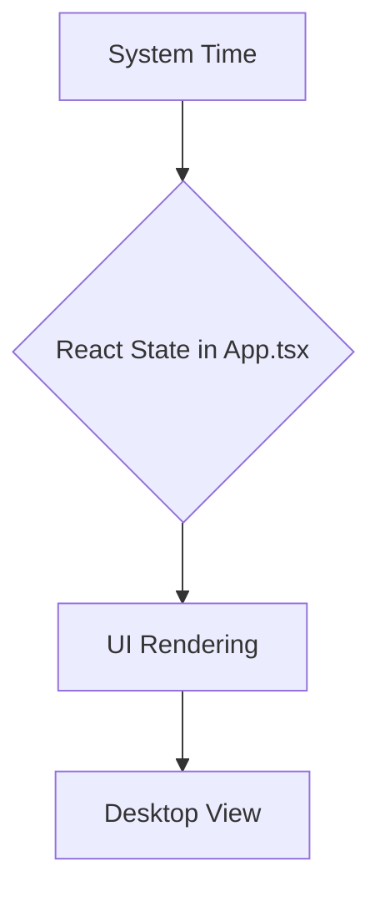

# Circadian Rhythm App — Architecture

## 1. High-Level Overview

The application is a native desktop app for macOS built with Tauri and React. It displays the user's current circadian rhythm phase in a clean, visual interface.

*   **Frontend**: React with TypeScript, built using Vite. The entire UI is managed within a single primary component (`src/App.tsx`).
*   **Styling**: [shadcn/ui](https://ui.shadcn.com/) and [Tailwind CSS](https://tailwindcss.com/) for a modern, utility-first approach.
*   **Backend & Packaging**: [Tauri](https://tauri.app/) wraps the web frontend into a lightweight, secure, and native macOS application. All application logic is currently client-side.

## 2. File & Folder Structure

The project has been streamlined to a minimal structure.

```
/
│
├── src/
│   ├── components/
│   │   └── ui/              # shadcn/ui components (Card, etc.)
│   ├── App.tsx              # Main (and only) React component, contains all UI and logic
│   └── main.tsx             # React root renderer
│
├── src-tauri/
│   ├── icons/               # Application icons
│   ├── Cargo.toml           # Rust dependencies
│   ├── tauri.conf.json      # Tauri configuration (windows, build, etc.)
│   └── src/
│       └── main.rs          # Tauri Rust entry point
│
├── package.json             # Node.js dependencies
└── architecture.md          # This file
```

## 3. State & Data Flow

The application's state management is self-contained within the `App.tsx` component using standard React hooks.



1.  **System Time**: The `useEffect` hook in `App.tsx` polls the system's current time every second.
2.  **State Update**: The component's state (`useState`) is updated, triggering a re-render.
3.  **UI Rendering**: The main component re-renders to show the current time, the corresponding circadian phase, and the visual timeline.

This simple, centralized approach is sufficient for the MVP and keeps the logic easy to follow.

## 4. Next Steps & Future Enhancements

With the UI and core structure in place, focus can shift to enhancing functionality and user experience.

*   **[TODO] Refactor Logic**: Extract the circadian phase calculation logic from `App.tsx` into a dedicated utility file (e.g., `src/lib/circadian.ts`) to separate concerns and improve testability.
*   **[TODO] Menubar Mode**: Implement a menubar-only display. This will require creating a separate, smaller window in `tauri.conf.json` and a dedicated component to render a minimal view of the current phase.
*   **[TODO] User Preferences**: Allow users to customize their wake-up/sleep times to adjust the phase calculations accordingly. This will require adding a settings UI and persisting the configuration locally.
*   **[TODO] Native Integrations**: Explore Tauri plugins or native Swift code to integrate with Apple HealthKit for automatic sleep data, making phase calculations more accurate.